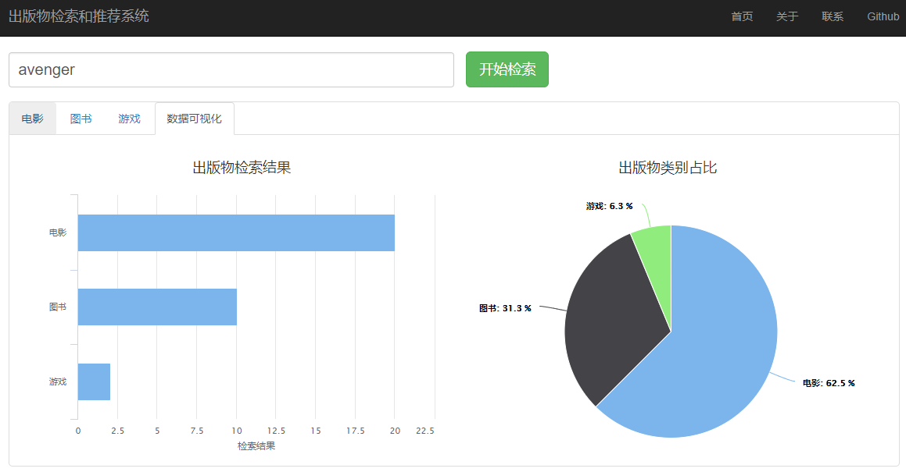

# frrs
基于知识图谱的出版物检索和推荐系统

### 说明
 + 相关文档在**docs**文件夹下
 + 系统已部署，链接地址[https://www.sparklego.cn](https://www.sparklego.cn/)
 + 项目基于PHP+Python语言，使用了YII2框架，数据源为dbpedia的链接开放数据

### 安装环境
 + Apache2.4 或 Nginx 1.12
 + PHP 5.6+
 + Python 2.7+
 + Python库SPARQLWrapper，可以使用pip安装

### 首页

***

### 搜索页

***

### 数据可视化与统计

***

### 出版物详情页

***
